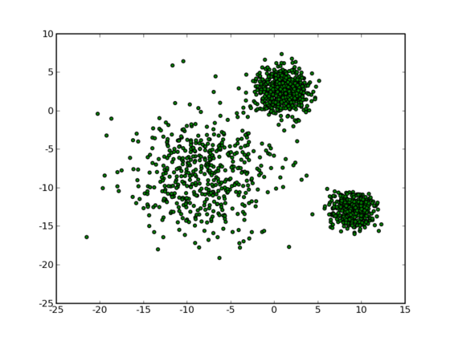
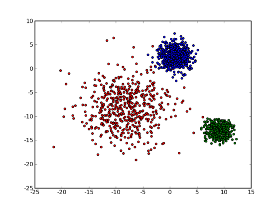
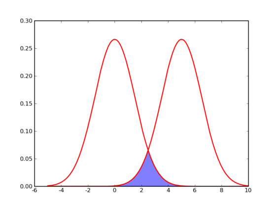

Clustering 中文翻译作“聚类”，简单地说就是把相似的东西分到一组，同 Classification (分类)不同，对于一个 classifier ，通常需要你告诉它“这个东西被分为某某类”这样一些例子，理想情况下，一个 classifier 会从它得到的训练集中进行“学习”，从而具备对未知数据进行分类的能力，这种提供训练数据的过程通常叫做 supervised learning (监督学习)，而在聚类的时候，我们并不关心某一类是什么，我们需要实现的目标只是把相似的东西聚到一起，因此，一个聚类算法通常只需要知道如何计算相似 度就可以开始工作了，因此 clustering 通常并不需要使用训练数据进行学习，这在 Machine Learning 中被称作 unsupervised learning (无监督学习)。

举一个简单的例子：现在有一群小学生，你要把他们分成几组，让组内的成员之间尽量相似一些，而组之间则差别大一些。最后分出怎样的结果，就取决于你对于“相似”的定义了，比如，你决定男生和男生是相似的，女生和女生也是相似的，而男生和女生之间则差别很大”，这样，你实际上是用一个可能取两个值“男”和“女”的离散变量来代表了原来的一个小学生，我们通常把这样的变量叫做“特征”。实际上，在这种情况下，所有的小学生都被映射到了两个点的其中一个上，已经很自然地形成了两个组，不需要专门再做聚类了。另一种可能是使用“身高”这个特征。我在读小学候，每周五在操场开会训话的时候会按照大家住的地方的地域和距离远近来列队，这样结束之后就可以结队回家了。除了让事物映射到一个单独的特征之外，一种常见的做法是同时提取 N 种特征，将它们放在一起组成一个 N 维向量，从而得到一个从原始数据集合到 N 维向量空间的映射——你总是需要显式地或者隐式地完成这样一个过程，因为许多机器学习的算法都需要工作在一个向量空间中。

那么让我们再回到 clustering 的问题上，暂且抛开原始数据是什么形式，假设我们已经将其映射到了一个欧几里德空间上，为了方便展示，就使用二维空间吧，如下图所示：

从数据点的大致形状可以看出它们大致聚为三个 cluster ，其中两个紧凑一些，剩下那个松散一些。我们的目的是为这些数据分组，以便能区分出属于不同的簇的数据，如果按照分组给它们标上不同的颜色，就是这个样子：

那么计算机要如何来完成这个任务呢？当然，计算机还没有高级到能够“通过形状大致看出来”，不过，对于这样的 N 维欧氏空间中的点进行聚类，有一个非常简单的经典算法，也就是本文标题中提到的 k-means 。在介绍 k-means 的具体步骤之前，让我们先来看看它对于需要进行聚类的数据的一个基本假设吧：对于每一个 cluster ，我们可以选出一个中心点 (center) ，使得该 cluster 中的所有的点到该中心点的距离小于到其他 cluster 的中心的距离。虽然实际情况中得到的数据并不能保证总是满足这样的约束，但这通常已经是我们所能达到的最好的结果，而那些误差通常是固有存在的或者问题本身的不可分性造成的。例如下图所示的两个高斯分布，从两个分布中随机地抽取一些数据点出来，混杂到一起，现在要让你将这些混杂在一起的数据点按照它们被生成的那个分布分开来：

由于这两个分布本身有很大一部分重叠在一起了，例如，对于数据点 2.5 来说，它由两个分布产生的概率都是相等的，你所做的只能是一个猜测；稍微好一点的情况是 2 ，通常我们会将它归类为左边的那个分布，因为概率大一些，然而此时它由右边的分布生成的概率仍然是比较大的，我们仍然有不小的几率会猜错。而整个阴影部分是我们所能达到的最小的猜错的概率，这来自于问题本身的不可分性，无法避免。因此，我们将 k-means 所依赖的这个假设看作是合理的。

基于这样一个假设，我们再来导出 k-means 所要优化的目标函数：设我们一共有 N 个数据点需要分为 K 个 cluster ，k-means 要做的就是最小化

$$
\displaystyle J = \sum_{n=1}^N\sum_{k=1}^K r_{nk} \|x_n-\mu_k\|^2
$$

这个函数，其中 $r_{nk}$ 在数据点 n 被归类到 cluster k 的时候为 1 ，否则为 0 。直接寻找 $r_{nk}$ 和 $\mu_k$ 来最小化 J 并不容易，不过我们可以采取迭代的办法：先固定 $\mu_k$ ，选择最优的 $r_{nk}$ ，很容易看出，只要将数据点归类到离他最近的那个中心就能保证 J 最小。下一步则固定 $r_{nk}$，再求最优的 $\mu_k$。将 J 对 $\mu_k$ 求导并令导数等于零，很容易得到 J 最小的时候 $\mu_k$ 应该满足：

$$
\displaystyle \mu_k=\frac{\sum_n r_{nk}x_n}{\sum_n r_{nk}}
$$

亦即 $\mu_k$ 的值应当是所有 cluster k 中的数据点的平均值。由于每一次迭代都是取到 J 的最小值，因此 J 只会不断地减小（或者不变），而不会增加，这保证了 k-means 最终会到达一个极小值。虽然 k-means 并不能保证总是能得到全局最优解，但是对于这样的问题，像 k-means 这种复杂度的算法，这样的结果已经是很不错的了。

k-means 算法的具体步骤：

- 选定 K 个中心 $\mu_k$ 的初值。这个过程通常是针对具体的问题有一些启发式的选取方法，或者大多数情况下采用随机选取的办法。因为前面说过 k-means 并不能保证全局最优，而是否能收敛到全局最优解其实和初值的选取有很大的关系，所以有时候我们会多次选取初值跑 k-means ，并取其中最好的一次结果。
- 将每个数据点归类到离它最近的那个中心点所代表的 cluster 中。
- 用公式 $\mu_k = \frac{1}{N_k}\sum_{j\in\text{cluster}_k}x_j$ 计算出每个 cluster 的新的中心点。
- 重复第二步，一直到迭代了最大的步数或者前后的 J 的值相差小于一个阈值为止。